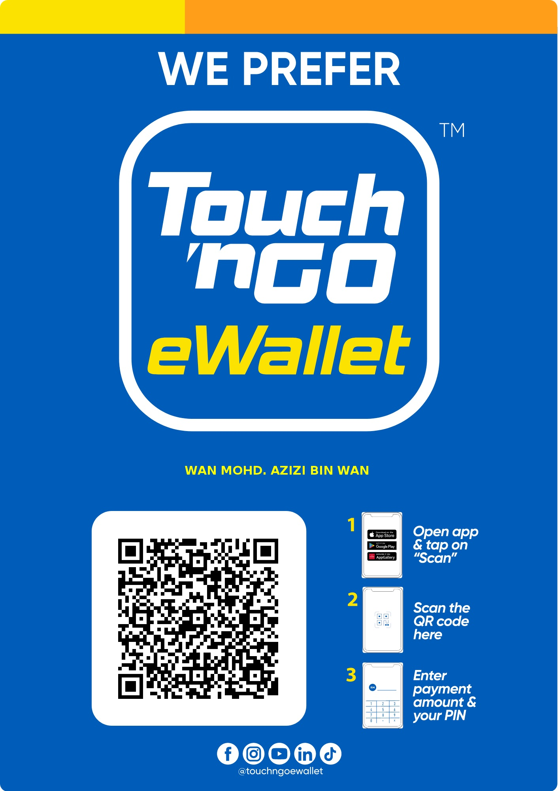

## 👋 Hi, I’m Rikayu Wilzam (Wan Mohd Azizi)

💻 Fullstack Developer | AI Integrator | Open-Source Builder
🌏 Based in Sarawak, Malaysia
⚙️ Currently working on Sarawak Native Language LLM Prototype (via Ollama + Cloud)
🧠 Passionate about AI tools, web systems, and language model integration

---

⚙️ Current Work Environment

I’m currently developing a localized AI model for Sarawak’s native language using Hugging Face datasets, Ollama CLI, and OpenRouter cloud LLMs.
My workflow includes WSL Ubuntu with KDE Plasma and Codex CLI for rapid prototyping.
| Stack / Tool                   | Description                                                                                                                                                                                                                        |
| ------------------------------ | ---------------------------------------------------------------------------------------------------------------------------------------------------------------------------------------------------------------------------------- |
| 🧠 **OpenAI Codex CLI**        | Core environment setup for code reasoning and AI workflow                                                                                                                                                                          |
| 💬 **Ollama CLI + Cloud**      | Prototype of Sarawak Native Language LLM                                                                                                                                                                                           |
| ☁️ **OpenRouter Cloud Models** | Multi-model selection without affecting local RAM:  • `deepseek-v3.1:671b-cloud`  • `gpt-oss:20b-cloud`  • `gpt-oss:120b-cloud`  • `kimi-k2:1t-cloud`  • `qwen3-coder:480b-cloud`  • `glm-4.6:cloud`             |
|| 🐧 **WSL Ubuntu + KDE Plasma** | Development base with UI customization                                                                                                                                                                                             |
|| ⚡ **Warp (Agent Mode)**       | Terminal + agentic development environment with project-scoped WARP.md, codebase indexing, and multi-file edits                                                                                                                    |
|| 🤗 **Hugging Face CLI**        | Fine-tuning datasets and LLM training pipeline                                                                                                                                                                                     |
|| 🧩 **Dataset Methods**         | 4 data types: 1️⃣ English → Native 2️⃣ Malay → Native 3️⃣ (English/Malay) → Native (Audio Transcription, ≤7s) 4️⃣ 2–5s Audio + Context: transcript snippet paired with surrounding context (speaker role, domain/topic, locale, intent, entities) to improve alignment efficiency in fine-tuning Temperature-controlled by response style: Logic / Creativity / Analytic / Casual / Professional / Custom |

---

🔨 **Ongoing Projects**

*(Follows same format as sample {A} – included for completeness if needed; no ongoing listed in B-2, so omitted unless required.)*
Device Class,Recommended Quant,Typical VRAM/RAM,Example Use,Notes
High-end,FP16 / GGUF Q8_0 / Q5_K_M,≥32–64GB RAM or ≥16–24GB VRAM,13B–70B (quantized),Larger context (4k–32k); set num_ctx≈4096–8192; f16_kv=true
Mid-end,"GGUF Q4_K_M / Q5_K_M, GPTQ 4-bit",16–32GB RAM or 8–12GB VRAM,7B–13B,Balance perf/quality; num_ctx≈2048–4096
Low-end,"GGUF Q3_K_M / Q4_0, AWQ/GPTQ 4-bit",8–16GB RAM or iGPU,3B–7B,Keep num_ctx≈1024–2048; prefer smaller vocab/rank

💡 Programming Language Proficiency

| Language                        | Framework / Tool               | Familiarity |
| ------------------------------- | ------------------------------ | ----------- |
| **HTML5**                       | Pug, Tailwind CSS, Live Server | ⭐⭐⭐⭐        |
| **CSS3**                        | Tailwind CSS                   | ⭐⭐⭐⭐        |
| **JavaScript (ES6+)**           | React.js, Express.js           | ⭐⭐⭐⭐        |
| **Python**                      | Flask                          | ⭐⭐⭐⭐        |
| **PHP**                         | Miniconda Local Env            | ⭐⭐⭐         |
| **Node.js**                     | REST API, JSON                 | ⭐⭐⭐⭐        |
| **YAML / JSON**                 | Config & API integration       | ⭐⭐⭐⭐        |
| **AI / LLM Prompt Engineering** | Hugging Face, Ollama, OpenAI   | ⭐⭐⭐⭐        |

┌─────────────────────────────────────┐
│ Rikayu's WakaTime Stats             │
├─────────────────────────────────────┤
│ Python   ████████  42%   15h 30m    │
│ JavaScript ██████  28%   10h 12m    │
│ HTML/CSS ████  18%    6h 45m        │
│ Others   ██   12%    4h 18m         │
└─────────────────────────────────────┘

Consistent workflow across full-stack development and AI integration. **Familiarity are based with tacit on hand durong "main-project & side- project developmet"**

💻 IDE & Extensions

| Tool            | Badge / Icon                                                                                               | Description                                      |
| --------------- | ---------------------------------------------------------------------------------------------------------- | ------------------------------------------------ |
| **VS Code**     |  | Main code editor for full-stack + AI development |
| **GitHub**      |              | Repository hosting & version control             |
| **Git Bash**    | 🌿                                                                                                         | Command-line shell for Git operations            |
| **Git Graph**   | 📊                                                                                                         | Visual commit and branch management              |
| **Kilocode**    | 🔧                                                                                                         | AI-assisted coding workspace                     |
| **Live Server** | 🔴                                                                                                         | Real-time frontend testing environment           |

🌐 Browsers
| Browser        | Icon | Use Case                                                |
| -------------- | ---- | ------------------------------------------------------- |
| **Perplexity** | 🔍   | AI-assisted research & analysis                         |
| **Chrome**     | 🌐   | Primary development browser                             |
| **Opera GX**   | 🎮   | Secondary test environment for performance benchmarking |

🖥️ Operating Systems

| OS                           | Badge / Icon                                                                                      | Role                                            |
| ---------------------------- | ------------------------------------------------------------------------------------------------- | ----------------------------------------------- |
| **Windows**                  |  | Core desktop environment                        |
| **Linux (KDE Plasma / WSL)** |        | Native development + AI fine-tuning environment |

🧮 **Quantization Profiles (local inference)**

| Device Class | Recommended Quant              | Typical VRAM/RAM      | Example Use       | Notes                                           |
| ------------ | ------------------------------ | --------------------- | ----------------- | ----------------------------------------------- |
| High-end     | FP16 / GGUF Q8_0 / Q5_K_M      | ≥32–64GB RAM or ≥16–24GB VRAM | 13B–70B (quantized) | Larger context (4k–32k); set num_ctx≈4096–8192; f16_kv=true |
| Mid-end      | GGUF Q4_K_M / Q5_K_M, GPTQ 4-bit | 16–32GB RAM or 8–12GB VRAM | 7B–13B            | Balance perf/quality; num_ctx≈2048–4096         |
| Low-end      | GGUF Q3_K_M / Q4_0, AWQ/GPTQ 4-bit | 8–16GB RAM or iGPU   | 3B–7B             | Keep num_ctx≈1024–2048; prefer smaller vocab/rank |

---

🚀 **Projects Overview**

| Project                                         | Description                                                                                       | Stack / Tools                                      | Integration & Features                                                                 | Status     |
| ----------------------------------------------- | ------------------------------------------------------------------------------------------------- | -------------------------------------------------- | -------------------------------------------------------------------------------------- | ---------- |
| 🎚️ **Colorblind Mode Toggle**                  | Accessible Light/Dark/Colorblind theme toggle for web and WordPress with colorblind subtypes and keyboard support; persists via localStorage. | HTML, CSS, JavaScript, WordPress                   | Classes: theme-light, theme-dark, theme-cb, cb-* · Persistence: a11y.theme, a11y.cbType · Demo: web/index.html | ✔️ Complete |
| 🗺️ **Lezy QRCode Map Generator**               | Full-stack QR code & map generation system specialized for small, home-based, and local shops. Designed for businesses seeking a self-managed delivery/order system, as an alternative to Foodpanda, Grab, or Gojek. | Python, HTML, CSS, JavaScript, Flask               | Use Case: Local shop map tagging + customer QR orders                                  | ✔️ Complete |
| 🧪 **Lezy Web Benchmark**                       | Website performance & analysis tool for front-end and back-end testing.                           | Python, HTML, CSS, JavaScript                      | Deployment: Netlify Preview: Lezy Web Benchmark                                     | ✔️ Complete |
| 🔐 **Minimalistic Login/Signup System**         | Lightweight authentication framework using pure PHP & MySQL.                                      | PHP (Native), Apache, HTML, CSS, MySQL             | Integration: OAuth2.0 via Supabase Providers: Facebook, GitHub, Google, Email Optional: Local or Remote DB integration Security: JWT-based token system | ✔️ Complete |
| 💫 **Dynamic .GIF & Video Autoplay Card**       | Dual-mode interactive card system featuring .GIF animation with dynamic video autoplay when viewed via camera (mobile/webcam). Designed for wedding invitations or as a Travel Digital Souvenir (autoplays video on supported devices). | HTML, CSS, JavaScript, Media API, Device Detection | Modes: Wedding Card / Travel Souvenir Feature: Conditional autoplay for supported devices | ✔️ Complete |
| 🎟️ **Animated E-Ticket Product (Private)**     | End-to-end E-Ticket Management System featuring an admin dashboard, web/mobile accessibility, and animated ticket UI. Built with a clean, functional design emphasizing scalability, speed, and user experience. | React.js, Node.js, Express, MySQL, Tailwind CSS    | Feature: Role-based access, ticket animation, QR integration, dashboard analytics Access: 🔒 Private Repository | ✔️ Complete |

---

🔨 **Ongoing Projects**

| Project                                         | Description                                                                                       | Stack / Tools                            | Status                                     |
| ----------------------------------------------- | ------------------------------------------------------------------------------------------------- | ---------------------------------------- | ------------------------------------------ |
| 📺 **Wayang Seni Pujangga**                     | Website Streaming Provider                                                                        | HTML, CSS, JavaScript                    | 🚧 In Development                          |
| 💌 **iMomento**                                 | Virtual Live-feed Invitation Card                                                                 | HTML, CSS, JavaScript                    | 🚧 In Development                          |
| 📄 **Simply Me**                                | Document Report Generator                                                                         | Python, HTML                             | 🚧 In Development                          |
| 🧠 **Sarawak Native LLM Model**                 | Language model prototype for Sarawak native dialects                                              | Hugging Face, Ollama, OpenRouter, Python | ⚙️ Dataset Integration & Fine-tuning Phase |
| 🗃️ **Digital Video Repository (Remote/Local)** | Repository for hosting and managing videos with metadata tagging and user upload system           | Node.js, React.js, MongoDB               | ⚙️ Development                             |
| 🧭 **Landing Page 101**                         | Dynamic & customizable landing page template optimized for developer portfolios and startup pages | HTML, CSS, Tailwind, JavaScript          | ⚙️ Development                             |
| 🧾 **Portfolio 101**                            | Interactive developer portfolio site (React + Markdown + Animation effects)                       | React.js, Tailwind CSS, Framer Motion    | ⚙️ Development                             |
| 📊 **Simpli Report Generator API’s**            | Lightweight REST API for generating structured reports in PDF/Docx/CSV formats                    | Python (Flask/FastAPI), OpenAI API       | ⚙️ Development                             |
| 🔗 **MCP (Sarawak Native LLM Continuation)**    | API extension layer for integrating the Sarawak Native Model into web & app systems               | Hugging Face, FastAPI, Ollama Cloud      | ⚙️ Prototype Phase                         |
| 🌀 **QRGGIF: AR-integrated Animated QR Auth**   | Authentication system that scans **animated .GIF QR codes** to trigger **AR-based interactions**. Built for **event ticketing and interactive media**. Integrates camera sensors with **GIF decoding + AR overlay triggers**. | React Native, Tkinter, MySQL, AR Engine, Netlify, Supabase | ⚙️ AR Integration & Authentication Phase || 

  Project                                   | Description                                                                                                                                                                                                                                                                                     | Contact                                                                                                                                                                                      |
| ----------------------------------------- | ----------------------------------------------------------------------------------------------------------------------------------------------------------------------------------------------------------------------------------------------------------------------------------------------- | -------------------------------------------------------------------------------------------------------------------------------------------------------------------------------------------- |
| 🌐 **Ultimate Event 3D Interactive Page** | Concept project exploring a **3D immersive event platform** that integrates ticketing, AR/VR-based venue navigation, and real-time social interaction.    Intended as a **next-gen event engagement experience**, combining 3D visuals, interactive maps, and virtual attendance systems. | 💌 **Interested in funding or collaboration?**   📧 [wan.mohd.azizi.seggaf@gmail.com](mailto:wan.mohd.azizi.seggaf@gmail.com)   📧 [ctaxnagomi@gmail.com](mailto:ctaxnagomi@gmail.com) |
| 🌀 **QRGGIF: AR-integrated Animated QR Auth System** | A hybrid **QR + AR** authentication project that fuses **animated .GIF QR codes** with **augmented reality triggers**. When scanned, the system verifies the GIF’s unique frame signature to **authenticate and project AR content**—ideal for event tickets, interactive media, and product experiences. | 💡 **Deployment:** Netlify   ⚙️ **Database:** Supabase + MySQL   🧩 **Integration:** AR SDK + React Native Frontend |

💰 Donations & Contributions

I truly appreciate every contribution — it helps fund ongoing open-source and AI innovation like the Sarawak Native LLM, Lezy Solutions Projects, and future creative tools.
For project-based contributions or collaborations, please contact me directly at:
📧 wan.mohd.azizi.seggaf@gmail.com
📧 ctaxnagomi@gmail.com

🌍 Crypto Contributions
| Cryptocurrency     | Badge                                                                                                | Address                                                                                                   | QR Code                                                                                               |
| ------------------ | ---------------------------------------------------------------------------------------------------- | --------------------------------------------------------------------------------------------------------- | ----------------------------------------------------------------------------------------------------- |
| **Bitcoin (BTC)**  |     | `bc1q65qjzvwyq2czumpy6tevtv2lgqvmvn3gh54ym7`                                                              | 

🟠 Show QR
  
     |
| **Ethereum (ETH)** |  | `0xd5d0AF6c78F4E203C5121740a747E92F0E4C9e5f`                                                              | 

🟣 Show QR
  
     |
| **XRP (Ripple)**   |              | `rUYHZ71yXAS54ZQNvvooLX7rFtZydXjnP`                                                                       | 

💧 Show QR
  
     |
| **Solana (SOL)**   |        | `7hphP53qK9CVZUs2atFSDxmW6zD2PM7zLgryeCSPj9iH`                                                            | 

🌈 Show QR
  
  |
| **Cardano (ADA)**  |     | `addr1qx6r76z06h4ynnsxavwla7jpzhn0wrjtg2wgx7mgm8xhhmwl5nvwe8r678glwy8wkv2tw6rdx624mhh4jhy2y6vd6hdqmc9l5a` | 

🔵 Show QR
  
 |

💡 All donations directly support development, testing, and infrastructure for AI, automation, and creative tech projects.

💵 Local Support (Malaysia)
| Platform                       | Badge                                                                                                                                                            | Payment Link                                                                               | QR Codes                                                                                                                                                                                             |
| ------------------------------ | ---------------------------------------------------------------------------------------------------------------------------------------------------------------- | ------------------------------------------------------------------------------------------ | ---------------------------------------------------------------------------------------------------------------------------------------------------------------------------------------------------- |
| **Touch ‘n Go (TNG Business)** |  | [payment.tngdigital.com.my/sc/bDLnQhnx4s](https://payment.tngdigital.com.my/sc/bDLnQhnx4s) | 

📲 Show QR Codes
 **Standard:**    **DuitNow:**   
 |

